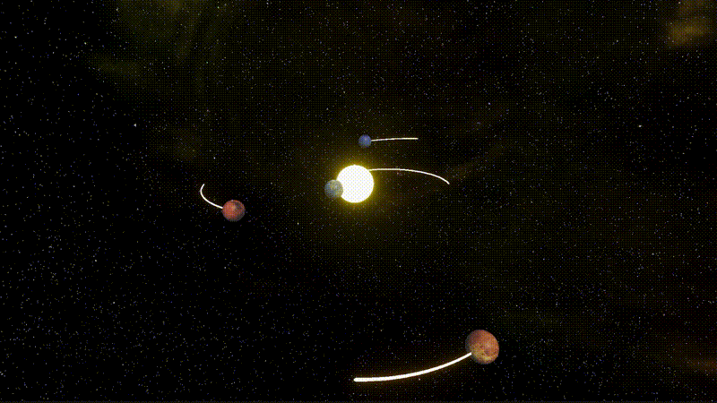
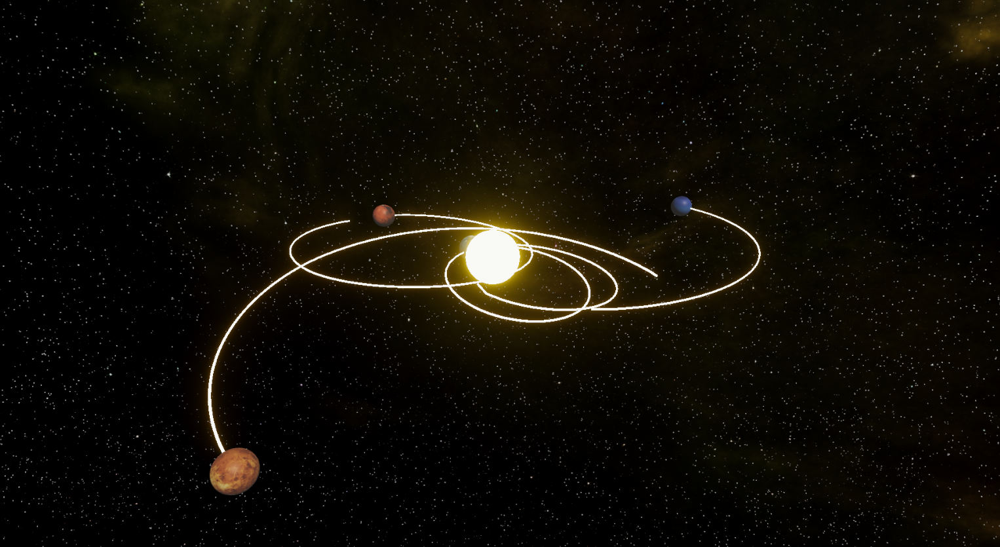
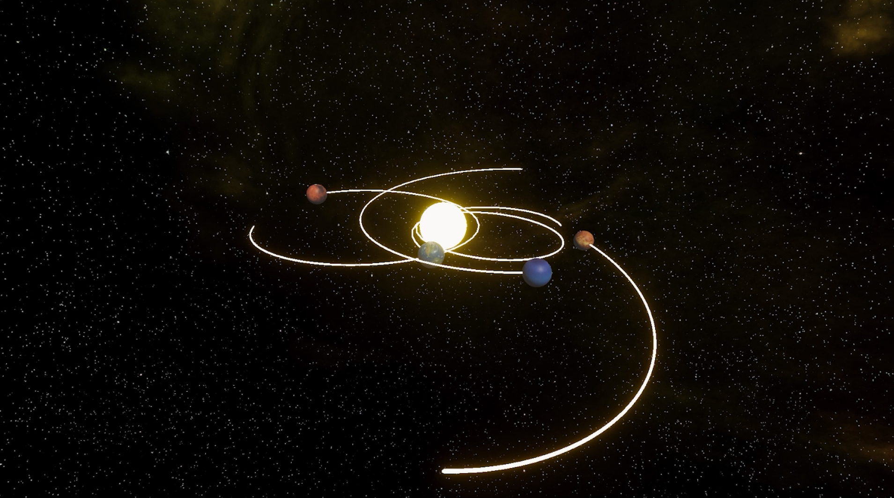
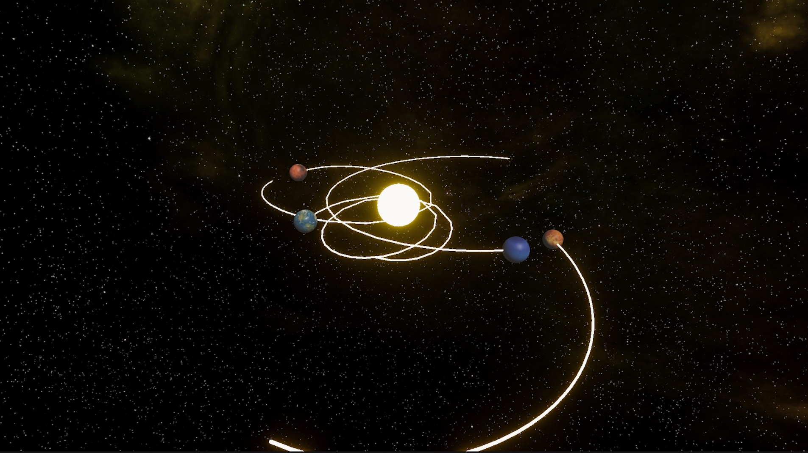

# Unity N-Body Simulation

### Real-Time Gravitational Physics Engine (GSoC 2026 Entry Task + Prototype)

<p align="center">
  <a href="Images/demo3.mp4">
    
  </a>
</p>

<p align="center">
  <b>Real-time multi-body orbital simulation built with Unity</b><br>
  A foundation for <b>AR-based planetary physics systems</b>
</p>

---

## About The Project

This project implements a real-time N-body gravitational simulation in Unity, modeling how multiple celestial bodies interact under Newtonian gravity.

It is developed as a Proof of Concept (POC) for my GSoC 2026 proposal:

> “AR Gravity & Planetary Physics Simulator”  
> (International Catrobat Association)

---

## Why This Matters

Simulating multiple gravitational bodies is computationally complex and numerically unstable.  
This project focuses on solving that in real-time while maintaining:

- Stability
- Visual clarity
- Performance

This makes it suitable for interactive environments such as Augmented Reality (AR).

---

## What This Prototype Demonstrates

- Multi-body gravitational interactions (3–5 bodies)
- Central massive object (Sun-like system)
- Stable orbital motion in real-time
- Numerical integration (Semi-implicit Euler)
- 3D orbital planes with tilt
- Orbit visualization using Trail Renderer

---

## Demo

<p align="center">
  
  
</p>

<p align="center">
  <i>Real-time simulation of gravitational interactions in Unity</i>
</p>

---

## Screenshots

<p align="center">
  
  
  
</p>

---

## How It Works

Each body contains:

- Mass
- Position
- Velocity

### Simulation Loop (FixedUpdate)

1. Compute gravitational forces between all bodies
2. Calculate acceleration
3. Update velocity
4. Update position

### Stability Mechanism

To avoid numerical instability:

- A softening factor is applied
- Prevents infinite forces at very small distances
- Ensures smooth and stable simulation

---

## Physics Model

```
F = (G × m₁ × m₂) / r²
```

Where:

- G → Gravitational constant
- m₁, m₂ → Masses
- r → Distance between bodies

---

## Key Features

- Semi-implicit Euler integration for stable real-time updates
- Real-time N-body simulation
- O(n²) force computation
- Semi-implicit Euler integration
- Fixed timestep physics (FixedUpdate)
- 3D orbital dynamics
- Clean and modular architecture
- Orbit trails for visualization

---

## Technical Highlights

- O(n²) pairwise force computation for N-body interaction
- Two-phase update system (compute → apply)
- Softened gravity model for stability
- Deterministic physics loop
- Balanced performance vs accuracy
- Designed for real-time execution within Unity’s physics update loop

---

## Tech Stack

| Component     | Technology        |
| ------------- | ----------------- |
| Engine        | Unity             |
| Language      | C#                |
| Physics Model | Newtonian Gravity |
| Update System | Fixed timestep    |

---

## Project Structure

```
Assets/            # Scripts, materials, scenes
Packages/          # Unity dependencies
ProjectSettings/   # Unity configuration
Images/            # GIFs, screenshots, demos
```

---

## Getting Started

### Clone the Repository

```bash
git clone https://github.com/adhishcantcode/Real-time-N-body-gravitational-simulation-in-Unity.git
cd Real-time-N-body-gravitational-simulation-in-Unity
```

### Run the Project

1. Open Unity Hub
2. Add the cloned project
3. Open the main scene
4. Press Play

> Ensure Unity version compatibility

---

## Related Work

- Python N-body Simulation  
  https://github.com/adhishcantcode/N-Body-Gravitational-Simulation

- AR Planet Simulation  
  https://github.com/adhishcantcode/AR-Planet-Simulation

---

## Future Scope (GSoC Proposal)

This prototype will evolve into:

- AR-based planetary system using AR Foundation
- Real-world surface placement
- Advanced integration methods (Verlet / Runge-Kutta)
- Performance scaling for larger systems
- Interactive controls (spawn, scale, reset bodies)

---

## Author

Adhish Gupta

- GitHub: https://github.com/adhishcantcode

---

## Acknowledgment

Developed as part of my application to:

International Catrobat Association – GSoC 2026

---

## Notes for Evaluators

- Implements core N-body physics from scratch
- Focus on stability and real-time performance
- Designed as a direct AR extension base
- Clean, readable, and modular code structure

---

<p align="center">
  If you found this project useful, consider starring the repository.
</p>
